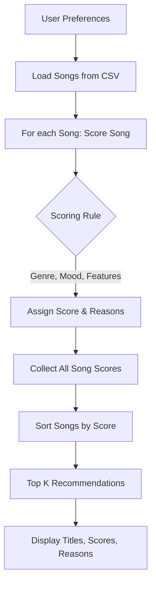

# 🎵 Music Recommender Simulation

## Project Summary

In this project you will build and explain a small music recommender system.

Your goal is to:

- Represent songs and a user "taste profile" as data
- Design a scoring rule that turns that data into recommendations
- Evaluate what your system gets right and wrong
- Reflect on how this mirrors real world AI recommenders


This project simulates a basic music recommender system that matches user preferences to song features. It demonstrates how real-world platforms like Spotify or YouTube use both collaborative and content-based filtering to suggest music, but focuses on a content-based approach using song attributes and user taste profiles.


## How The System Works


### How The System Works

**Song Features Used:**
- genre (categorical)
- mood (categorical)
- energy (0.0–1.0)
- valence (0.0–1.0)
- danceability (0.0–1.0)
- tempo_bpm (integer)
- acousticness (0.0–1.0)

**UserProfile Stores:**
- favorite_genre
- favorite_mood
- target_energy
- target_valence
- target_danceability
- target_tempo_bpm
- target_acousticness

**Scoring Rule:**
- +2.0 points for genre match
- +1.0 point for mood match
- Up to +1.0 point for each numerical feature (energy, valence, danceability, tempo, acousticness), based on similarity: 
    - $1 - |song\_feature - user\_target|$
    - For tempo: $1 - \frac{|song\_tempo - user\_target\_tempo|}{max\_tempo\_range}$

**Ranking Rule:**
- After scoring all songs, the system sorts them by score and recommends the top K songs.

**Summary:**
The recommender evaluates each song based on how closely it matches the user's preferences, then ranks and returns the best matches. This approach demonstrates how data-driven recommendations work in practice.

---

## Algorithm Recipe

- +2.0 points for genre match
- +1.0 point for mood match
- Up to +1.0 point for each numerical feature (energy, valence, danceability, tempo, acousticness), based on similarity: $1 - |song\_feature - user\_target|$
- For tempo: $1 - \frac{|song\_tempo - user\_target\_tempo|}{max\_tempo\_range}$

**Example User Profile:**
```python
user_profile = {
    "favorite_genre": "pop",
    "favorite_mood": "happy",
    "target_energy": 0.8,
    "target_valence": 0.8,
    "target_danceability": 0.8,
    "target_tempo_bpm": 120,
    "target_acousticness": 0.2
}
```

---

## Data Flow Diagram

The following Mermaid.js flowchart visualizes the recommendation process:



---

## Getting Started

### Setup

1. Create a virtual environment (optional but recommended):

   ```bash
   python -m venv .venv
   source .venv/bin/activate      # Mac or Linux
   .venv\Scripts\activate         # Windows

2. Install dependencies

```bash
pip install -r requirements.txt
```

3. Run the app:

```bash
python -m src.main
```


---

## Personal Reflection

My biggest learning moment during this project was seeing how simple math-based rules can create recommendations that feel surprisingly relevant, even without complex AI. Using AI tools helped me brainstorm features, generate new data, and quickly test different logic, but I always needed to double-check the results and make sure the explanations made sense. I was surprised by how much changing a single weight (like energy) could shift the recommendations, and how easy it is for a system to get "stuck" recommending the same style if the dataset or logic is too narrow. If I extended this project, I would focus on adding more features, improving diversity in the results, and making the explanations even clearer for users.

Run the starter tests with:

```bash
pytest
```

You can add more tests in `tests/test_recommender.py`.

---

## Experiments You Tried

Use this section to document the experiments you ran. For example:

- What happened when you changed the weight on genre from 2.0 to 0.5
- What happened when you added tempo or valence to the score
- How did your system behave for different types of users

---

## Limitations and Risks

Summarize some limitations of your recommender.

Examples:

- It only works on a tiny catalog
- It does not understand lyrics or language
- It might over favor one genre or mood

You will go deeper on this in your model card.

---

## Reflection

Read and complete `model_card.md`:

[**Model Card**](model_card.md)

Write 1 to 2 paragraphs here about what you learned:

- about how recommenders turn data into predictions
- about where bias or unfairness could show up in systems like this


---

## 7. `model_card_template.md`

Combines reflection and model card framing from the Module 3 guidance. :contentReference[oaicite:2]{index=2}  

```markdown
# 🎧 Model Card - Music Recommender Simulation

## 1. Model Name

Give your recommender a name, for example:

> VibeFinder 1.0

---

## 2. Intended Use

- What is this system trying to do
- Who is it for

Example:

> This model suggests 3 to 5 songs from a small catalog based on a user's preferred genre, mood, and energy level. It is for classroom exploration only, not for real users.

---

## 3. How It Works (Short Explanation)

Describe your scoring logic in plain language.

- What features of each song does it consider
- What information about the user does it use
- How does it turn those into a number

Try to avoid code in this section, treat it like an explanation to a non programmer.

---

## 4. Data

Describe your dataset.

- How many songs are in `data/songs.csv`
- Did you add or remove any songs
- What kinds of genres or moods are represented
- Whose taste does this data mostly reflect

---

## 5. Strengths

Where does your recommender work well

You can think about:
- Situations where the top results "felt right"
- Particular user profiles it served well
- Simplicity or transparency benefits

---

## 6. Limitations and Bias

Where does your recommender struggle

Some prompts:
- Does it ignore some genres or moods
- Does it treat all users as if they have the same taste shape
- Is it biased toward high energy or one genre by default
- How could this be unfair if used in a real product

---

## 7. Evaluation

How did you check your system

Examples:
- You tried multiple user profiles and wrote down whether the results matched your expectations
- You compared your simulation to what a real app like Spotify or YouTube tends to recommend
- You wrote tests for your scoring logic

You do not need a numeric metric, but if you used one, explain what it measures.

---

## 8. Future Work

If you had more time, how would you improve this recommender

Examples:

- Add support for multiple users and "group vibe" recommendations
- Balance diversity of songs instead of always picking the closest match
- Use more features, like tempo ranges or lyric themes

---

## 9. Personal Reflection

A few sentences about what you learned:

- What surprised you about how your system behaved
- How did building this change how you think about real music recommenders
- Where do you think human judgment still matters, even if the model seems "smart"

